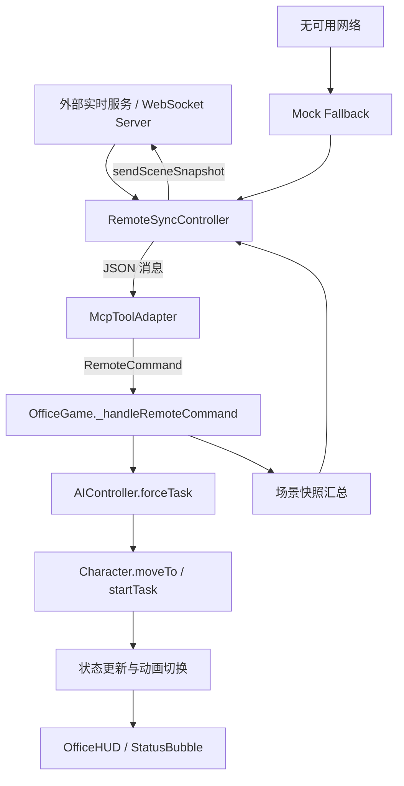

# 联网与 MCP 工具调用流程图



## 通道说明

- 主通道：外部 WebSocket 服务
- 退化通道：内置 Mock 指令流
- 指令协议：原始状态消息、MCP 工具调用消息、JSON-RPC 风格工具调用

## 典型输入示例

```json
{
  "method": "tools/call",
  "params": {
    "name": "set_character_state",
    "arguments": {
      "characterName": "Rosalind",
      "state": "work",
      "duration": 18
    }
  }
}
```
